# HandyServ

Handy Serv is a service providing platform(both website and mobile application) 
Order any service any time is the motto 
Service inludes electrician, gutter cleaning, plumber, house cleaning, car wash, gardening assistance and many more 
Platforms core services- 
    *   Post & search work for vendors for particular 
service 
    *   Search & Ordering Services from one click 
    *   Search Vendor(Service Provider) Nearby 
    *   Realtime Conversation(Chat System) 
    *   Realtime Negotiations (budget & time) 
    *   Managing Orders 
    *   Customized Feed 
    *   Usage of Card Payment 

 
<b>Mobile App Video Demonstration(User & Vendors):</b>

 
<b>Mobile Application Apk:</b>

[Download and install apk](https://drive.google.com/file/d/1tlOFCE2iIgP-XfThBVXsoiBU1Xm6BnO9/view?usp=share_link)

  
<b>User/Customers:</b>
https://handyserv.ca/
<h6> Test User Credentials
--------------------- 
Email: ew@g.co 
Password: 123456
user email: testc@gmail.com 
user Password: Ab123456</h6>

<b>Vendors:</b>
https://vendor.handyserv.ca/
<h6> Test Vendor Credentials
--------------------- 
Email: mridul.das.work@gmail.com 
Password: Ab123456</h6>

     
<b>Mobile App Screenshots:</b>

    
    
    
    
    
    
    
    
    
    
    
    
    
    
    
    
    
    
    
    
    
    
    
    
    
    
    
    
    
    
    
    
    
    
    
    
    
    
    
    
    
    
    
    
    
    
    
    
    
    
    
    
    
    
    
    
    
    
    
    
    
    
    
    
    
    
    
        
<b>Website- User UI:</b>

    
    
    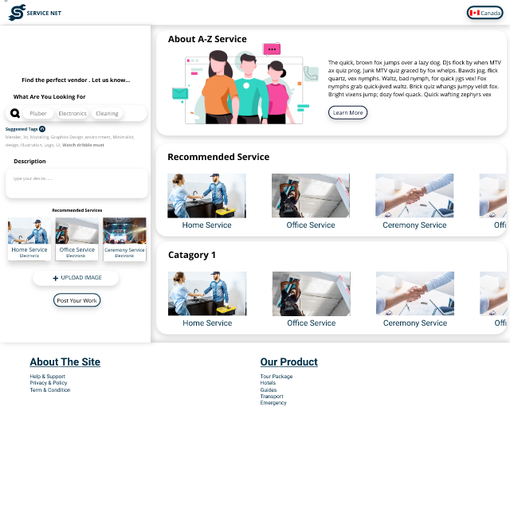
    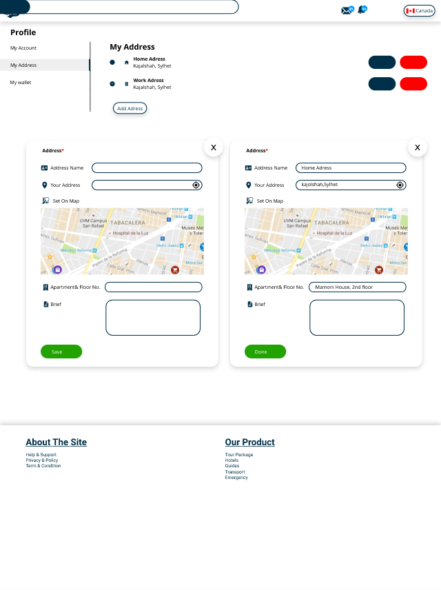
    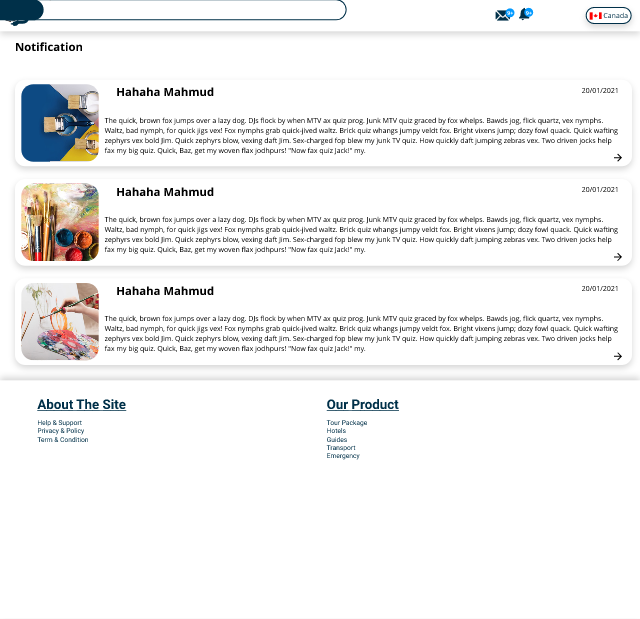
    
    
    
    
    
    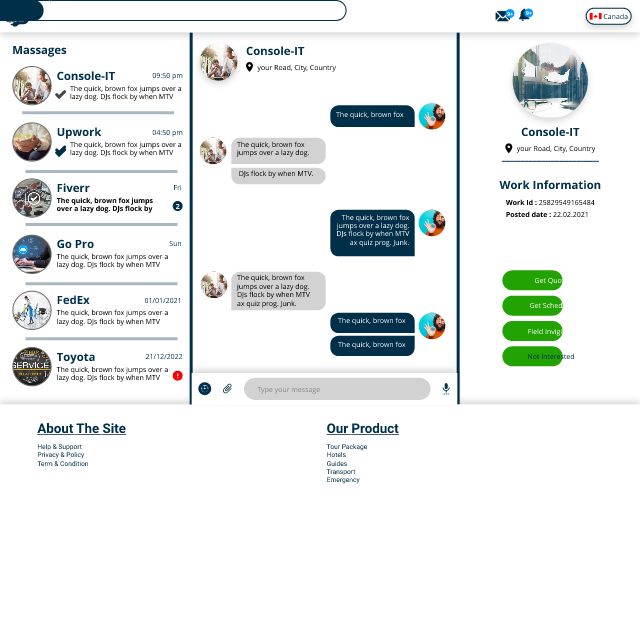
    
    
    
    
    
    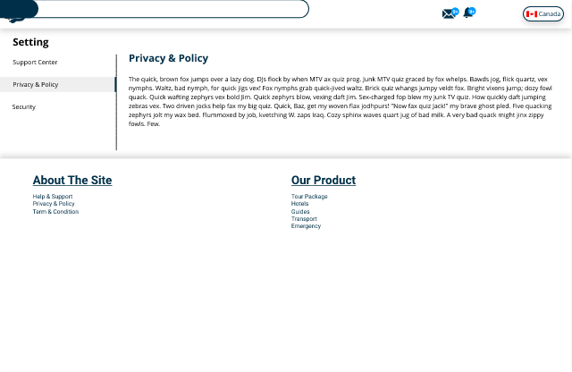
    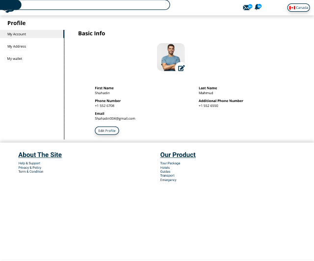
    
    
    
    
    
    
    
    
    
    
    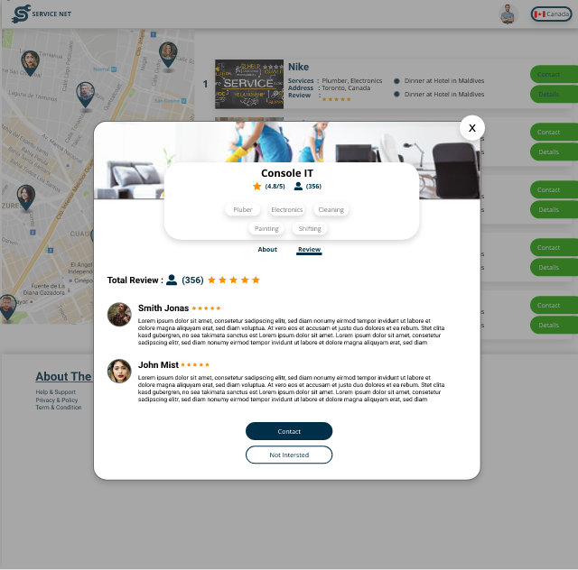
        
     
<b>Website- Vendor UI:</b>

    
    
    
    
    
    
    
    
    
    
    
    
    
    
    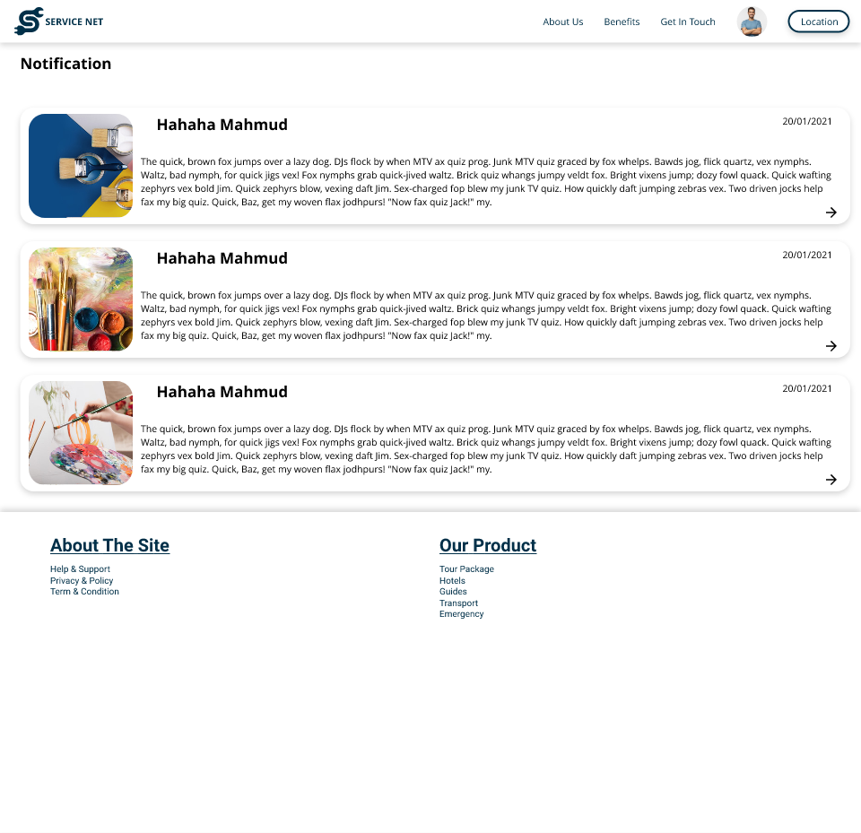
    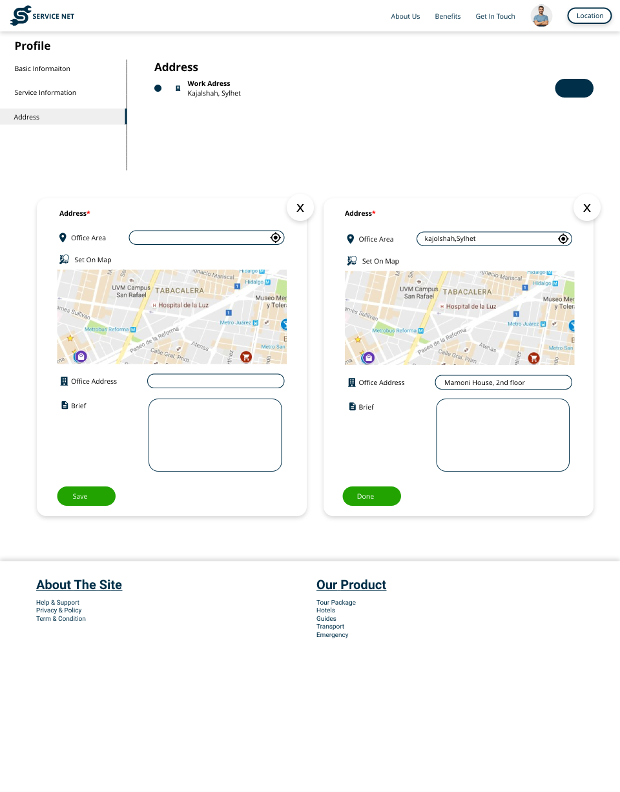
    
    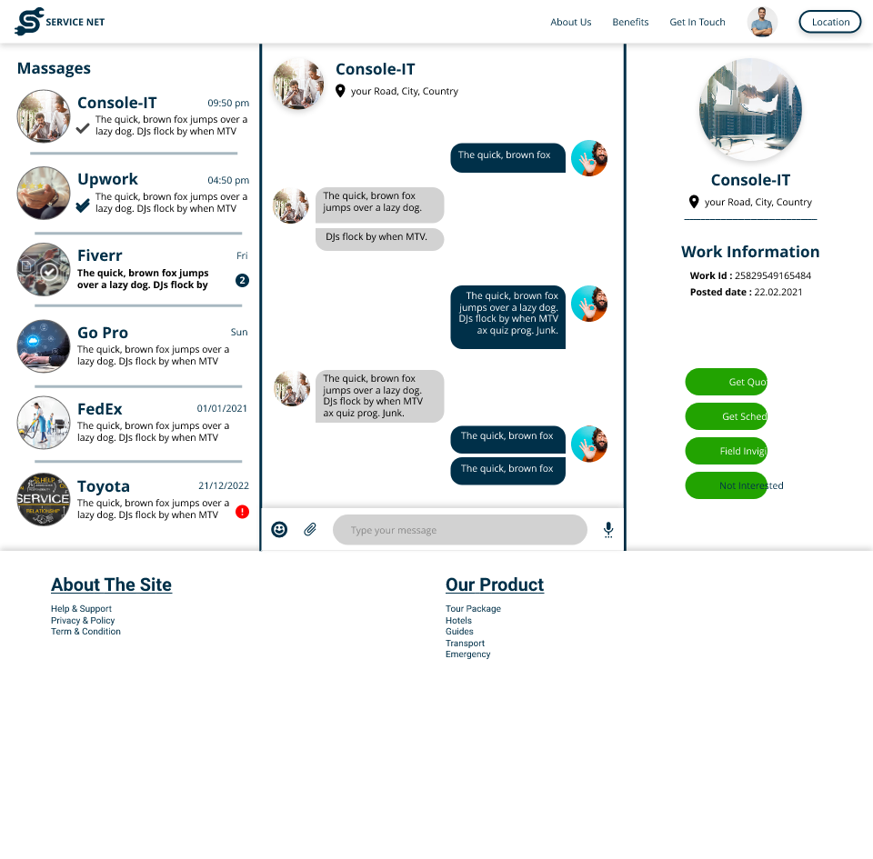
    
    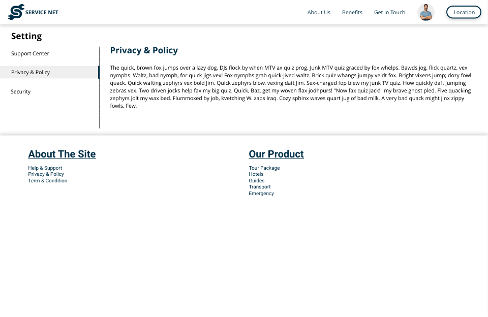
    

